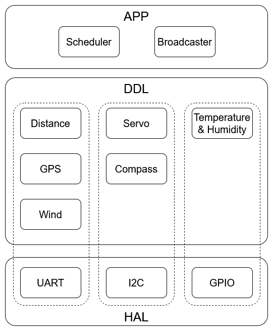
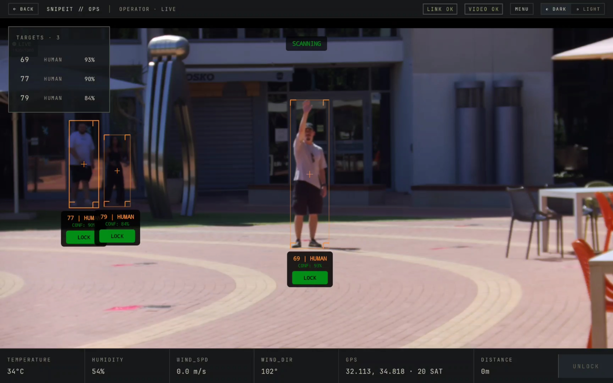
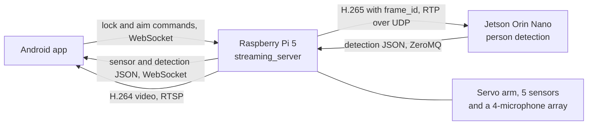
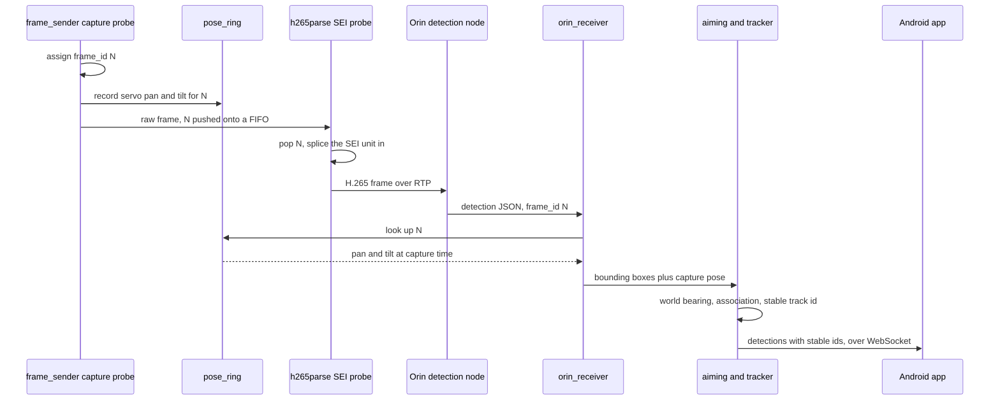
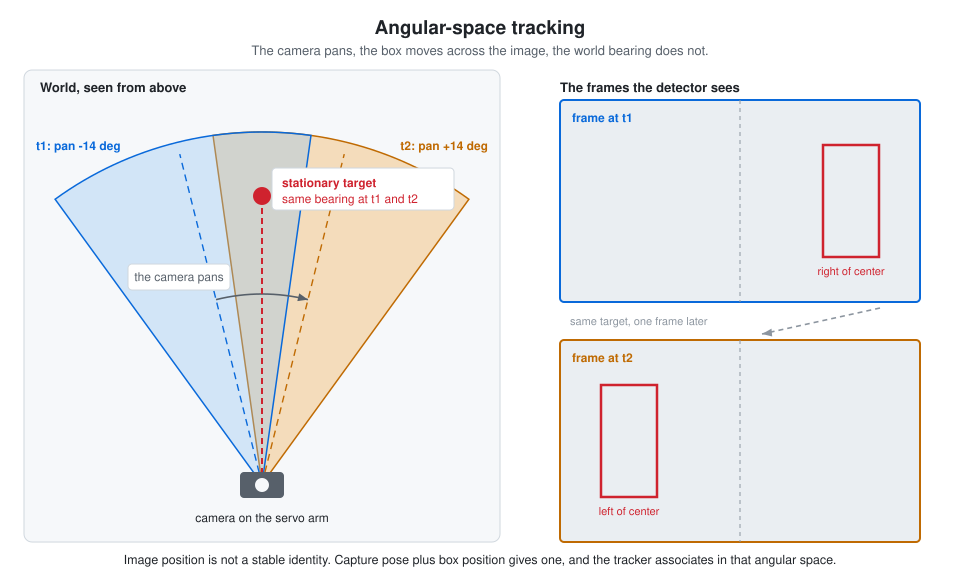
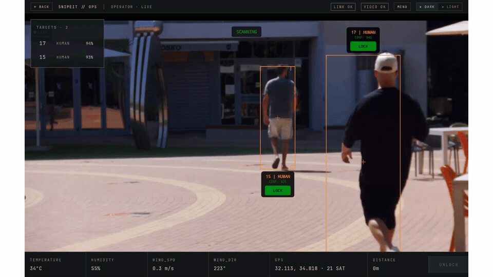
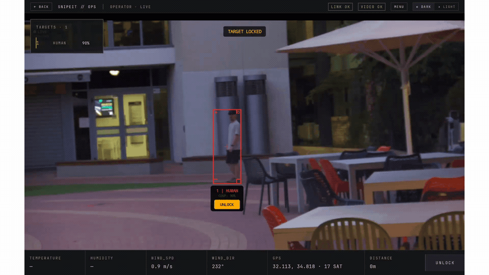
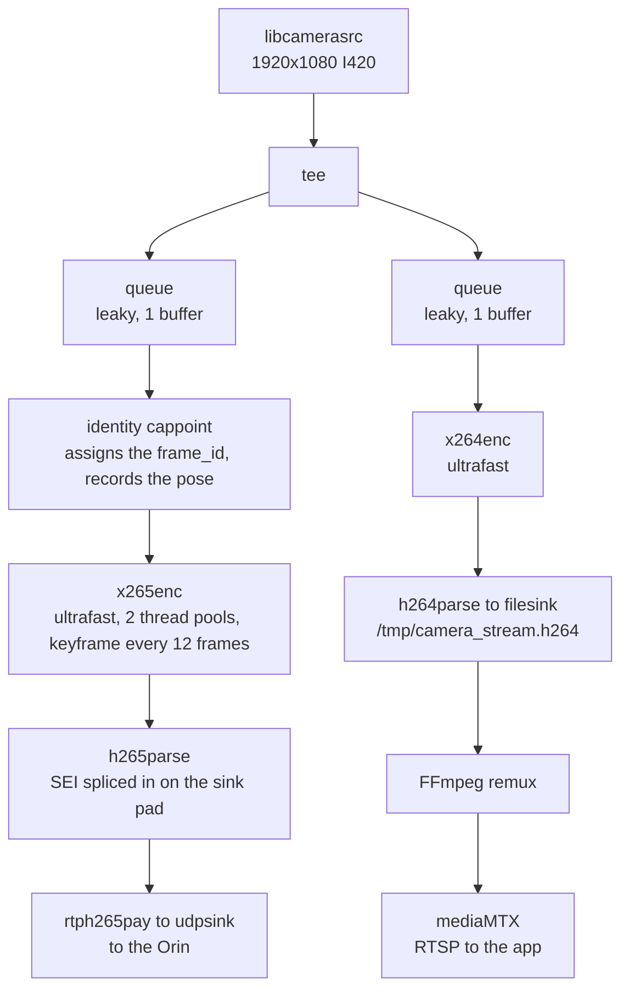
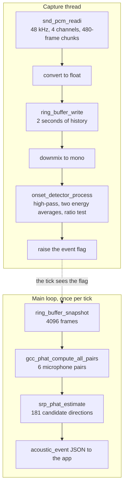

# SnipeIt

A remotely operated reconnaissance and fire-solution platform. A Raspberry Pi 5
runs a device layer in C that drives a servo arm and five sensors, streams video
to a Jetson Orin Nano for object detection, and serves an Android companion app
over WebSocket.

## Repository map

| Path | Contents |
|---|---|
| [`src/`](https://github.com/emilglater/SnipeIt/tree/ae0983ddb8bf8063b8b59bca9a159cb3bda26477/src) | Embedded layer in C: HAL, OSAL, Active Object framework, DDL sensor drivers, scheduler, broadcaster |
| [`pi-streaming/`](https://github.com/emilglater/SnipeIt/tree/ae0983ddb8bf8063b8b59bca9a159cb3bda26477/pi-streaming) | C server: WebSocket, video pipeline, Orin protocol, acoustic DSP |

### Related repositories

| Repository | Contents |
|---|---|
| [`smart-spotter-orin`](https://github.com/giladf424/smart-spotter-orin) | The detection node that runs on the Jetson Orin Nano, plus a directory of Jupyter notebooks used to build the datasets and train the person-detection model. Public, and has its own README |
| [`SnipeItApp/MySnipeIt`](https://github.com/emilglater/SnipeIt/tree/ae0983ddb8bf8063b8b59bca9a159cb3bda26477/SnipeItApp/MySnipeIt) | The Android app. Developed in its own repository and merged into this one. Has its own README |

The Orin receives H.265 video over RTP and returns detections over ZeroMQ. It is
stateless and never sees pose, distance or angles, which
[wire contract A](#wire-contract-a---frames-to-the-orin) and
[wire contract B](#wire-contract-b---detections-back-to-the-pi) spell out. The
app receives an RTSP video preview, plus sensor readings and detections as JSON
over WebSocket, and sends lock and aim commands back over the same socket, all
described under [the app link](#the-app-link).

---

## Architecture - the Active Object framework

The whole hardware layer is built around one main pattern: every peripheral is an
Active Object that runs on its own thread, with a blocking event queue, and a finite
state machine. Each module uses the event bus for communication with the others.

- **[The Active Object event loop](https://github.com/emilglater/SnipeIt/blob/ae0983ddb8bf8063b8b59bca9a159cb3bda26477/src/util/active_object/active_object.c#L6-L29)** -
  pop an event from the queue, break on `eFSM_EVENT_END`, otherwise dispatch
  it into the FSM.
- **[The blocking queue](https://github.com/emilglater/SnipeIt/blob/ae0983ddb8bf8063b8b59bca9a159cb3bda26477/src/util/queue/queue.c#L39-L88)** -
  mutex plus condition variable, so an idle Active Object thread sleeps
  instead of spinning.
- **[The FSM](https://github.com/emilglater/SnipeIt/blob/ae0983ddb8bf8063b8b59bca9a159cb3bda26477/src/util/fsm/fsm.h#L22-L33)** -
  three types (`StateFP`, `Event`, `FSM`) save the FSM state and enable transition.
- **[State transition](https://github.com/emilglater/SnipeIt/blob/ae0983ddb8bf8063b8b59bca9a159cb3bda26477/src/util/fsm/fsm.c#L37-L53)** -
  exit event, swap the state function pointer, entry event, so any state can
  pair setup in ENTRY with the matching teardown in EXIT and be certain both run.
- **[Event bus publish](https://github.com/emilglater/SnipeIt/blob/ae0983ddb8bf8063b8b59bca9a159cb3bda26477/src/util/event_bus/event_bus.c#L88-L113)** -
  matches on (Active Object id, event type) and calls each subscriber's own
  post function, which is why no module ever includes another module's header.

## Module registration and scheduling



- **[The DDL module table](https://github.com/emilglater/SnipeIt/blob/ae0983ddb8bf8063b8b59bca9a159cb3bda26477/src/ddl/ddl.c#L27-L128)** -
  each peripheral holds its start and stop functions and the events it wants to
  hear about, so adding a sensor requires adding a row instead of editing code.
- **[The registration loop](https://github.com/emilglater/SnipeIt/blob/ae0983ddb8bf8063b8b59bca9a159cb3bda26477/src/ddl/ddl.c#L130-L153)** -
  goes over the modules once at startup, starting each module and signing it up
  on the event bus for every event it listed.
- **[Scheduler timing](https://github.com/emilglater/SnipeIt/blob/ae0983ddb8bf8063b8b59bca9a159cb3bda26477/src/app/scheduler/scheduler_config.h)** -
  the whole timing policy is one place: the 2 second cycle divided by the number
  of slots gives us its tick period.
- **[The tick handler](https://github.com/emilglater/SnipeIt/blob/ae0983ddb8bf8063b8b59bca9a159cb3bda26477/src/app/scheduler/scheduler_fsm.c#L15-L21)** -
  the timer callback only drops a tick event into the scheduler's own queue,
  so the real work still happens on the scheduler thread.
- **[The run state](https://github.com/emilglater/SnipeIt/blob/ae0983ddb8bf8063b8b59bca9a159cb3bda26477/src/app/scheduler/scheduler_fsm.c#L85-L124)** -
  each tick moves one slot forward and sends that slot its event, so every
  sensor gets its own turn and no two of them reach for the hardware at the same
  time.

## An example of a complete module (distance sensor)

The distance sensor driver is the first sensor module we completed, upon which
we based all the other sensors, so they all read the same way.

- **[Wire format](https://github.com/emilglater/SnipeIt/blob/ae0983ddb8bf8063b8b59bca9a159cb3bda26477/src/ddl/distance/distance_fsm.c#L23-L58)** -
  the request command and the layout of the reply, taken byte for byte from the
  sensor datasheet.
- **[The READ state](https://github.com/emilglater/SnipeIt/blob/ae0983ddb8bf8063b8b59bca9a159cb3bda26477/src/ddl/distance/distance_fsm.c#L239-L267)** -
  sends the command, asks for the reply, starts a timeout and returns
  immediately, so the thread is never left waiting on the sensor.
- **[Completion callbacks and retry](https://github.com/emilglater/SnipeIt/blob/ae0983ddb8bf8063b8b59bca9a159cb3bda26477/src/ddl/distance/distance_fsm.c#L146-L173)** -
  the UART and timer callbacks only send an event back into the FSM instead of
  doing the work themselves, which is what keeps things safe thread-wise and
  timing-wise.

## Hardware and protocol work

- **[Asynchronous UART](https://github.com/emilglater/SnipeIt/blob/ae0983ddb8bf8063b8b59bca9a159cb3bda26477/src/hal/uart/hal_uart.c#L108-L178)** -
  a read often comes back with only part of the reply, so the completion thread
  asks for the rest and calls the driver back only once the full buffer has arrived.
- **[Reading a register over I2C](https://github.com/emilglater/SnipeIt/blob/ae0983ddb8bf8063b8b59bca9a159cb3bda26477/src/hal/i2c/hal_i2c.c#L189-L216)** -
  sends the target register address and reads the answer back as a pair of messages.
- **[Reading a GPIO pin](https://github.com/emilglater/SnipeIt/blob/ae0983ddb8bf8063b8b59bca9a159cb3bda26477/src/hal/gpio/hal_gpio.c#L115-L138)** -
  a single call that returns the pin level right away.
- **[AM2302 single-wire bit decoding](https://github.com/emilglater/SnipeIt/blob/ae0983ddb8bf8063b8b59bca9a159cb3bda26477/src/ddl/temperature_humidity/temperature_humidity_fsm.c#L125-L148)** -
  the sensor sends each bit as a pulse on a single wire, and the code calculates
  whether the bit is a one or a zero by timing how long that pulse lasts.
- **[Event-driven GPS configuration](https://github.com/emilglater/SnipeIt/blob/ae0983ddb8bf8063b8b59bca9a159cb3bda26477/src/ddl/gps/gps_fsm.c#L247-L297)** -
  the configuration moves one step forward each time the previous step reports
  back.
- **[PCA9685 PWM frequency](https://github.com/emilglater/SnipeIt/blob/ae0983ddb8bf8063b8b59bca9a159cb3bda26477/src/ddl/servo/servo_fsm.c#L79-L113)** -
  changing the PWM frequency means putting the chip to sleep, writing the new 
  value and waking it again, in exactly that order, as the datasheet requires.
- **[Servo angle to PWM](https://github.com/emilglater/SnipeIt/blob/ae0983ddb8bf8063b8b59bca9a159cb3bda26477/src/ddl/servo/servo_fsm.c#L202-L241)** -
  turns a requested angle into a pulse width using the measured range of the
  servos, and rejects angles the arm can't physically reach.

## Sensor data aggregation

- **[The shared frame](https://github.com/emilglater/SnipeIt/blob/ae0983ddb8bf8063b8b59bca9a159cb3bda26477/src/ddl/ddl_frame.h)** -
  one struct with a field per sensor, with the padding spelled out so its size
  and layout stay the same during transmition.
- **[The broadcaster snapshot](https://github.com/emilglater/SnipeIt/blob/ae0983ddb8bf8063b8b59bca9a159cb3bda26477/src/app/broadcaster/broadcaster_fsm.c#L7-L50)** -
  copies the live readings into a second copy once per scheduler cycle, so the
  app always gets a matching set of values instead of catching some sensors
  mid-update.

---

## Hardware tests

The measurement programs live on the [`measurements`](https://github.com/emilglater/SnipeIt/tree/0e16c93826957b875ad3cb9c075bba6624d9a420/tests_hw)
branch, because they need an extra instrumentation module and code that we
deliberately keep out of the production build.

- **[The test build](https://github.com/emilglater/SnipeIt/blob/0e16c93826957b875ad3cb9c075bba6624d9a420/tests_hw/Makefile#L11-L12)** -
  builds against every production source except `main.c`, so the numbers come
  from the code that actually ships rather than from a copy written for the test.

### Test 1 - Active Object dispatch latency

- **[Method 1](https://github.com/emilglater/SnipeIt/blob/0e16c93826957b875ad3cb9c075bba6624d9a420/tests_hw/test1_event_bus_latency.c#L1-L11)** -
  measures how long an event waits between entering a queue and being picked
  up, with the whole system running, so the numbers include the real competition
  between threads.

### Test 2 - GPS static position scatter

- **[Method 2](https://github.com/emilglater/SnipeIt/blob/0e16c93826957b875ad3cb9c075bba6624d9a420/tests_hw/test2_gps_scatter.c#L1-L15)** -
  records how far the reported position drifts while the unit sits still.

### Test 3 - Pan axis accuracy, repeatability and hysteresis

- **[Method 3](https://github.com/emilglater/SnipeIt/blob/0e16c93826957b875ad3cb9c075bba6624d9a420/tests_hw/test3_turret_accuracy.c#L1-L25)** -
  uses the compass as the angle reference as it turns together with the arm.

### Instrumentation

- **[The timing rule](https://github.com/emilglater/SnipeIt/blob/0e16c93826957b875ad3cb9c075bba6624d9a420/src/util/trace/util_trace.h#L30-L39)** -
  the send has to be recorded before the event goes into the queue, otherwise
  the thread can pick it up first and every later pair of timestamps comes out
  shifted by one.
- **[The two added hooks](https://github.com/emilglater/SnipeIt/blob/0e16c93826957b875ad3cb9c075bba6624d9a420/tests_hw/hooks.diff)** -
  measuring the framework needed two extra calls in `active_object.c`.
- **[From raw data to the reported numbers](https://github.com/emilglater/SnipeIt/blob/0e16c93826957b875ad3cb9c075bba6624d9a420/tests_hw/reduce.py#L22-L31)** -
  turns the CSVs into the average, the 95th percentile and the worst case that
  can later be used for analysis.

## Host unit tests

- **[Active Object framework](https://github.com/emilglater/SnipeIt/blob/ae0983ddb8bf8063b8b59bca9a159cb3bda26477/test/active_object/test_active_object.c)** -
  covers thread startup, initialization and sending events, to test the active
  object logic.
- **[Distance FSM with the hardware mocked out](https://github.com/emilglater/SnipeIt/blob/ae0983ddb8bf8063b8b59bca9a159cb3bda26477/test/distance/test_distance.c)** -
  CMock stands in for the UART, the timer and the FSM, and the test keeps hold
  of the callbacks the driver hands over so it can trigger them itself, which is
  how the state machine gets tested with no hardware attached.

---

## pi-streaming - the Pi-side server



*Three targets at once across a sun and shade split. One stands in direct sun,
two in the hard shadow of a building.*

`pi-streaming/` is a single C process, `streaming_server`. It owns the camera and
coordinates everything else. It streams video to a Jetson Orin Nano for object
detection, drives the servo arm through the device layer in root `src/`, and
serves the Android app. A separate module listens on a four-microphone array and
reports the direction a gunshot came from, covered under
[acoustic direction finding](#acoustic-direction-finding).

Detection runs on the Orin. All geometry, pose, tracking and servo control stay
on the Pi.

Three data flows run at the same time.

1. **Frames, Pi to Orin.** H.265 over RTP on UDP. Every frame carries a
   `frame_id`.
2. **Detections, Orin to Pi.** ZeroMQ, one JSON message per frame, echoing the
   `frame_id` the detections came from.
3. **Pi to app.** Video over RTSP, plus a WebSocket channel carrying telemetry,
   detections and commands.



### Wire contract A - frames to the Orin

Every frame the Pi sends carries the id the Pi will later use to recover where
the camera was pointing when that frame was captured. The id rides inside the
compressed stream itself.

H.265 carries everything in Network Abstraction Layer (NAL) units. One kind,
Supplemental Enhancement Information (SEI), is defined as optional: a decoder
that does not recognize it must skip it. That makes SEI the safe place to put a
`frame_id`, because a decoder that knows nothing about SnipeIt still plays the
stream.

- Prefix SEI unit, `nal_unit_type` 39, `payloadType` 5
  (`user_data_unregistered`).
- The payload is a 16-byte UUID followed by the `frame_id` as 4 bytes,
  most significant byte first.
- The UUID is `53 6e 69 70 65 49 74 46 72 6d 49 44 00 00 00 01`, which is ASCII
  `SnipeItFrmID` followed by `0,0,0,1`. Both sides must use exactly this value.
- The unit is spliced in ahead of the first picture data of each frame.
- Transport is `rtph265pay config-interval=1 pt=96` into `udpsink`, port 5600
  by default.

An H.265 byte stream may never contain the three-byte run `00 00 01`, because
that run marks the start of the next unit. An encoder that would otherwise
produce it inserts a `03` byte to break it up. Those are the
emulation-prevention bytes, and any code that writes or reads a unit by hand has
to handle them.

- **[Building the SEI unit](https://github.com/emilglater/SnipeIt/blob/ae0983ddb8bf8063b8b59bca9a159cb3bda26477/pi-streaming/orin/sei_frame_id.c#L22-L70)** -
  assembles the header, the UUID and the four id bytes, then copies the result
  out through the emulation-prevention scan.
- **[Reading it back](https://github.com/emilglater/SnipeIt/blob/ae0983ddb8bf8063b8b59bca9a159cb3bda26477/pi-streaming/orin/sei_frame_id.c#L72-L127)** -
  the inverse. Strip the emulation-prevention bytes, walk the payload type and
  size fields, and only accept the unit if the UUID matches.

### Wire contract B - detections back to the Pi

- ZeroMQ PUSH and PULL. The Pi is the PULL end and binds, the Orin is the PUSH
  end and connects, so the Orin can restart on its own.
- The endpoint is `tcp://0.0.0.0:5556`.
- One ZeroMQ message is one JSON object. There is no line framing, because the
  message boundary already is the object boundary. The parser takes a pointer
  and a length.

```json
{
  "type": "target_detection",
  "frame_id": 12345,
  "timestamp_ms": 678,
  "detections": [
    { "id": "1", "class": "HUMAN", "confidence": 0.85,
      "bbox": {"x": 100, "y": 50, "width": 200, "height": 400} }
  ]
}
```

- `frame_id` is the join key. Both sides join on it and never on the timestamp.
- Bounding boxes are in full 1920x1080 source-frame pixels with a top-left
  origin, and any letterboxing or resizing the detector needed has already been
  reversed on the Orin.
- `detections[].id` is a label for one frame only. It is not stable between
  frames. The Pi replaces it with its own stable track id before the app sees
  it.
- Unknown keys are skipped, so the Orin can add fields without breaking the Pi.

- **[The detection parser](https://github.com/emilglater/SnipeIt/blob/ae0983ddb8bf8063b8b59bca9a159cb3bda26477/pi-streaming/orin/detection_msg.c#L310-L357)** -
  written by hand, with no allocation and no external library. Every field is
  bounded, and anything it does not recognize is skipped rather than rejected.
- **[The receive loop](https://github.com/emilglater/SnipeIt/blob/ae0983ddb8bf8063b8b59bca9a159cb3bda26477/pi-streaming/orin/orin_receiver.c#L68-L124)** -
  polls with a timeout so shutdown latency is bounded, retries on an interrupted
  call, and drains everything already queued before polling again so a burst
  does not back up.

Put together, one frame makes this round trip.



### Why tracking happens on the Pi, in angular space

This is the load-bearing idea in the whole system, and it is what `pose_ring`,
`aiming` and `tracker` exist for.

The camera pans and tilts constantly, either on a scan pattern or following a
locked target. A target standing still in the world therefore sweeps across the
image from one frame to the next. Matching detections by where their boxes sit
in the image would break every time the camera moved.

The Orin only ever sees pixels. The Pi is the only side that knows where the
camera was pointing when each frame was captured, so the Pi is the only side
that can undo that motion.



The chain, end to end.

1. `frame_sender` assigns a `frame_id` at the capture point and fires a
   callback. `ddl_bridge` records the servo pan and tilt for that id in
   `pose_ring`.
2. A detection comes back echoing the same `frame_id`, and `pose_ring_lookup`
   recovers the capture pose.
3. `aim_compute` turns the bounding box, that pose and the field of view into an
   absolute world bearing, plus a range estimate.
4. `tracker` matches detections to existing tracks in that bearing space rather
   than in the image.

- **[The frame_id to pose join](https://github.com/emilglater/SnipeIt/blob/ae0983ddb8bf8063b8b59bca9a159cb3bda26477/pi-streaming/orin/pose_ring.c#L57-L118)** -
  the ring is scanned newest first under a mutex, because the id being looked up
  is nearly always among the last few recorded. Capacity is chosen in time
  rather than in frames: 16 entries hold several seconds of history at the rate
  this encode sustains.
- **[Bounding box to world bearing](https://github.com/emilglater/SnipeIt/blob/ae0983ddb8bf8063b8b59bca9a159cb3bda26477/pi-streaming/orin/aiming.c#L77-L116)** -
  the core geometry. The box center is normalized about the frame center, turned
  into an angle through the measured field of view, added to the pose the frame
  was captured at, and clamped to what the arm can reach.
- **[Range from box height](https://github.com/emilglater/SnipeIt/blob/ae0983ddb8bf8063b8b59bca9a159cb3bda26477/pi-streaming/orin/aiming.c#L118-L134)** -
  a pinhole model. A known target height and the box height in pixels give a
  distance.
- **[The motion compensation itself](https://github.com/emilglater/SnipeIt/blob/ae0983ddb8bf8063b8b59bca9a159cb3bda26477/pi-streaming/orin/tracker.c#L83-L107)** -
  22 lines. It reuses the aiming geometry to turn each box into an absolute
  bearing and an angular width, and the camera's own movement drops out.
- **[Association in angular space](https://github.com/emilglater/SnipeIt/blob/ae0983ddb8bf8063b8b59bca9a159cb3bda26477/pi-streaming/orin/tracker.c#L152-L325)** -
  greedy nearest neighbor, matching only within the same class, with the gate
  scaled by how wide the target subtends. A large nearby target is allowed to
  move further between frames than a small distant one. The locked target's
  track is pinned: it is matched first with a doubled gate before the greedy
  pass runs.
- **[The whole join in one function](https://github.com/emilglater/SnipeIt/blob/ae0983ddb8bf8063b8b59bca9a159cb3bda26477/pi-streaming/src/ddl_bridge.c#L236-L339)** -
  detection to pose to tracker to the app, and on to the servo when a target is
  locked.

The two field-of-view constants were measured on this rig rather than taken from
a datasheet, because at 1920x1080 libcamera picks a sensor mode and a crop that
narrow the lens's nominal angle. `script/probe_camera_fov.py` re-measures them.

A track has to be seen twice before it can be locked, it keeps its id while it
is unseen for up to 1.5 seconds, and when all 32 slots are full the
longest-unseen track is dropped. The locked track is exempt from both: its
lifetime is bounded by the operator's lock rather than by time, so it survives
a long slew or a crossing target that would recycle any other id. Two
conditions skip tracking for one frame: the `frame_id` is too old to still be
in the ring, or the frame was captured while the arm was still physically
moving toward a large commanded angle, a window that scales with the size of
the jump. In both cases the boxes are still forwarded to the app and the
existing tracks simply coast.



*Two targets cross and keep their ids.*

Once the operator locks a target, the same solution drives the arm.
`aim_compute` has already clamped the angles to the servo travel, so the bridge
hands them straight to the servo and publishes an event that makes the servo
apply them at once instead of waiting for the scheduler's next two-second slot.



*Lock follow, with the firing solution updating as the target moves.*

### The video pipeline

One GStreamer pipeline owns the camera and feeds both consumers from a single
capture. It starts once at boot and runs for the whole session. The app
connecting or disconnecting does not start or stop it.



Both branches hold references to the camera's own capture buffers, and that pool
holds about four. Each branch therefore uses a queue one buffer deep that drops
rather than blocks, so the slow H.265 encode cannot park the pool and stall
capture. `cappoint` sits after that queue, so a frame the queue drops can never
shift the `frame_id` away from the frame it belongs to.

- **[The whole pipeline build](https://github.com/emilglater/SnipeIt/blob/ae0983ddb8bf8063b8b59bca9a159cb3bda26477/pi-streaming/orin/frame_sender.c#L264-L457)** -
  both encoder branches and both probes. The pipeline is assembled as one
  description string, then the two probes are attached to the elements by
  name.
- **[Splicing the SEI unit in](https://github.com/emilglater/SnipeIt/blob/ae0983ddb8bf8063b8b59bca9a159cb3bda26477/pi-streaming/orin/frame_sender.c#L105-L164)** -
  takes the next `frame_id` from a FIFO instead of matching timestamps, and
  rebuilds the buffer with the unit inserted ahead of the picture data. B-frames
  are switched off so the encoder emits one frame out for one frame in, in
  order, which is what keeps the FIFO lined up.
- **[Finding where to splice](https://github.com/emilglater/SnipeIt/blob/ae0983ddb8bf8063b8b59bca9a159cb3bda26477/pi-streaming/orin/frame_sender.c#L43-L75)** -
  scans the frame for the start code of the first picture unit, skipping the
  parameter sets that precede it.

The splice happens on `h265parse`'s input rather than its output. Inserting a
unit after the parser leaves the packetizer with frame boundaries it no longer
agrees with, and the stream comes apart.

The preview branch encodes H.264 into a named pipe. FFmpeg remuxes that into
mediaMTX, which serves it to the app over RTSP.

### The app link

One app is connected at a time. Messages out:

| Message | When |
|---|---|
| `stream_ready` | On connect, carrying the RTSP port and stream name |
| `sensor_data` | Once per second, the aggregated sensor frame |
| `target_detection` | Once per detection message from the Orin |
| `acoustic_event` | Once per detected gunshot, see [acoustic direction finding](#acoustic-direction-finding) |

`target_detection` has the same shape as wire contract B with two changes. `id`
now carries the stable track id, and each detection gains a `confirmed` flag.
An empty `detections` array clears the app's overlay immediately.

Commands in:

| Command | Effect |
|---|---|
| `set_servo_angles` | Moves the arm to an explicit pan and tilt, clamped to the servo range. It cancels any active lock |
| `select_target` | Locks or unlocks. With a target id it locks and pins that track, without one it follows the highest-confidence detection |

### Server orchestration

- **[The 20 ms waker thread](https://github.com/emilglater/SnipeIt/blob/ae0983ddb8bf8063b8b59bca9a159cb3bda26477/pi-streaming/src/main.c#L84-L98)** -
  the WebSocket library ignores the timeout it is handed and blocks on its own,
  which can be tens of seconds on an idle link, and the main loop is the only
  thing servicing it. A separate thread calls `lws_cancel_service()` every
  20 ms, the one call documented as safe from another thread. That is what paces
  the entire loop at about 50 Hz, and it is why the loop needs no sleep of its
  own.
- **[Running is not publishing](https://github.com/emilglater/SnipeIt/blob/ae0983ddb8bf8063b8b59bca9a159cb3bda26477/pi-streaming/src/main.c#L191-L212)** -
  a child process being alive is not proof it is doing anything. FFmpeg can sit
  inside its input probe indefinitely on a starved pipe, so the server waits for
  the line FFmpeg prints only once it has actually opened its output before it
  tells the app the stream is ready.
- **[Graceful child shutdown](https://github.com/emilglater/SnipeIt/blob/ae0983ddb8bf8063b8b59bca9a159cb3bda26477/pi-streaming/src/process_manager.c#L72-L111)** -
  child processes are reaped automatically, which rules out `waitpid`. Liveness
  is polled with `kill(pid, 0)` instead: SIGTERM, up to three seconds of
  polling, then SIGKILL.

### Acoustic direction finding

Four INMP441 microphones sit on a forward-facing semicircle of radius 0.08 m, at
-90, -30, +30 and +90 degrees. Coordinates are +X to the right and +Y forward
along the camera boresight, with the origin at the center of the array. The
module reports the direction a gunshot came from, as an angle relative to that
boresight.

It is an independent sensor path. It shares only the WebSocket server, and never
touches the camera, the Orin link or the servos. If it cannot start, the server
says so and carries on without it, and nothing else degrades.

The work is split across two threads. The capture thread does the cheap
per-sample work and decides when something happened. The main loop does the
expensive transform work once, and only after something has.



**Deciding that something happened.** The onset detector runs on the mono
downmix. A 2nd-order Butterworth high-pass at 300 Hz strips the low-frequency
rumble first. Butterworth because it has the flattest passband of the standard
filter shapes, so it leaves the shape of the blast itself alone. Two running
averages of the squared sample then track energy over about 10 ms and over about
500 ms. A gunshot is a step change in the ratio between them, so the detector
fires when the short average exceeds the long one by a factor of 10. Three gates
keep that honest: a 500 ms refractory period so one shot produces one event, a
0.75 s warmup so the long average has settled, and a floor on the long average
so near-silence cannot manufacture a large ratio out of nothing.

- **[The per-sample loop](https://github.com/emilglater/SnipeIt/blob/ae0983ddb8bf8063b8b59bca9a159cb3bda26477/pi-streaming/acoustic/onset_detector.c#L123-L188)** -
  the filter, both averages and the three gates. The averages are exponential
  rather than true sliding windows. A 500 ms window at 48 kHz would need a
  24,000-sample buffer per channel, and the exponential form approximates it at
  one multiply-add per sample.

**Finding the delay between a pair of microphones.** Sound reaches the four
microphones at slightly different times, and those differences are what fix the
direction. Four microphones give six pairs, so six delays. Each one comes from a
cross-correlation computed through the frequency domain, with one extra step:
the cross-spectrum is divided by its own magnitude, which discards amplitude and
keeps only phase. That is the phase transform, the PHAT in GCC-PHAT, and for an
impulsive sound it turns a broad correlation hump into a sharp spike.

The array is 0.16 m across, so no real delay can exceed 0.16 m divided by the
speed of sound, about 466 microseconds, or 23 samples at 48 kHz. The peak search
is restricted to that window with a two-sample margin, and anything outside it
is a reflection or noise by definition.

- **[The computation for one pair](https://github.com/emilglater/SnipeIt/blob/ae0983ddb8bf8063b8b59bca9a159cb3bda26477/pi-streaming/acoustic/gcc_phat.c#L180-L326)** -
  two forward transforms, the phase transform, one inverse transform, then the
  peak search inside the physically possible window. The transform plans are
  built once at startup, never on the event path.
- **[Sub-sample precision](https://github.com/emilglater/SnipeIt/blob/ae0983ddb8bf8063b8b59bca9a159cb3bda26477/pi-streaming/acoustic/gcc_phat.c#L40-L76)** -
  one sample at 48 kHz is about 21 microseconds, coarser than the direction
  needs. Fitting a parabola through the peak and its two neighbors recovers
  roughly a tenth of a sample.

**Turning six delays into one direction.** The estimator sweeps candidate
directions from -90 to +90 degrees in 1 degree steps. For each candidate, the
array geometry gives the delay every pair should show. Each pair then scores how
close its measured delay is to that expectation, weighted by how strong its
correlation peak was, and the best-scoring angle wins.

- **[The expected delay for a candidate direction](https://github.com/emilglater/SnipeIt/blob/ae0983ddb8bf8063b8b59bca9a159cb3bda26477/pi-streaming/acoustic/srp_phat.c#L31-L60)** -
  the geometry. A plane wave arriving from a given angle reaches two microphones
  at times that differ by the projection of the baseline between them onto the
  direction of arrival.

The reported confidence is one minus the ratio of the mean score to the best
score across the sweep. A sharp peak against a flat background gives a number
near 1 and a flat sweep gives one near 0. It measures how well defined the
direction is, and it is not a probability.

**What the app receives.** One JSON object per event.

```json
{"type":"acoustic_event","timestamp_us":0,"azimuth_deg":0.0,
 "confidence":0.00,"peak_amplitude":0.0000,"duration_ms":0.0,"valid":false}
```

Every event is sent. `valid` is set when the confidence is above 0.3 and the
peak amplitude above 0.05, and the app decides what to do with it. Two fields
are easy to misread. `timestamp_us` comes from the monotonic clock and has an
arbitrary origin, so only differences between events mean anything.
`duration_ms` is the total time any sample sat above the amplitude threshold,
averaged across the four channels, rather than the length of one continuous
burst.

### Tests

Six tests cover the Orin path. Five of them need no extra dependency and run
together under `make test_orin`.

| Unit test | What it covers |
|---|---|
| [`test_sei_frame_id.c`](https://github.com/emilglater/SnipeIt/blob/ae0983ddb8bf8063b8b59bca9a159cb3bda26477/pi-streaming/test/test_sei_frame_id.c) | 4 cases, including a unit embedded in a longer stream |
| [`test_pose_ring.c`](https://github.com/emilglater/SnipeIt/blob/ae0983ddb8bf8063b8b59bca9a159cb3bda26477/pi-streaming/test/test_pose_ring.c) | 4 cases, including a concurrency run of roughly 200,000 lookups |
| [`test_detection_msg.c`](https://github.com/emilglater/SnipeIt/blob/ae0983ddb8bf8063b8b59bca9a159cb3bda26477/pi-streaming/test/test_detection_msg.c) | 8 cases: malformed input, overflow, truncation, unknown keys |
| [`test_aiming.c`](https://github.com/emilglater/SnipeIt/blob/ae0983ddb8bf8063b8b59bca9a159cb3bda26477/pi-streaming/test/test_aiming.c) | 7 cases: frame edges, clamping, distance, bad arguments |
| [`test_tracker.c`](https://github.com/emilglater/SnipeIt/blob/ae0983ddb8bf8063b8b59bca9a159cb3bda26477/pi-streaming/test/test_tracker.c) | 8 cases, built by inverting the aiming geometry so that a stationary target produces a moving box as the camera pans; four cover the locked-track protection |

- **[The integration test](https://github.com/emilglater/SnipeIt/blob/ae0983ddb8bf8063b8b59bca9a159cb3bda26477/pi-streaming/test/test_orin_receiver.c)** -
  a real ZeroMQ push socket feeding a real pull receiver over loopback, checking
  that a detection joins back to the capture pose it belongs to. It needs
  `libzmq3-dev` and has its own target, `make test_orin_receiver`.

All six pass.

### Known limitation

The Pi 5 has no hardware video encoder. The H.265 encode to the Orin therefore
runs in software, on the same four cores that also serve the access point and
relay the video to the app. That holds the Orin link to roughly 3 frames per
second, well under the 30 fps the app preview sustains.

The result is a skew between the video the operator sees and the detections
drawn over it, so a box can lag or trail a moving target.
